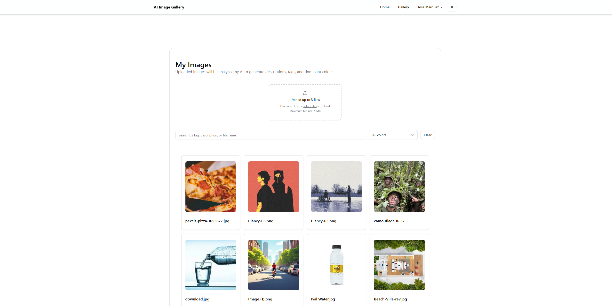
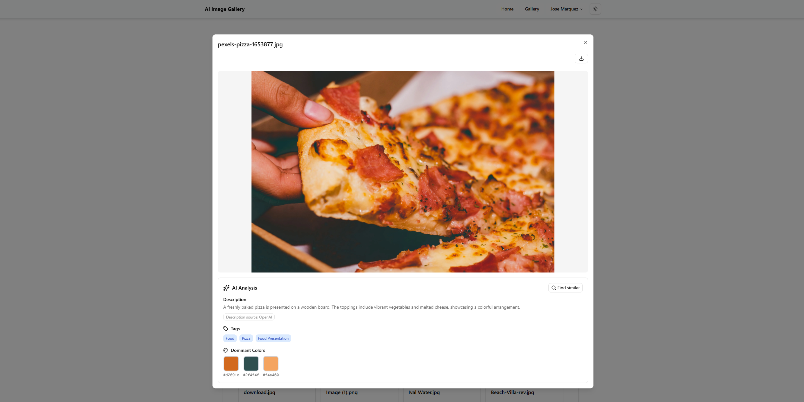
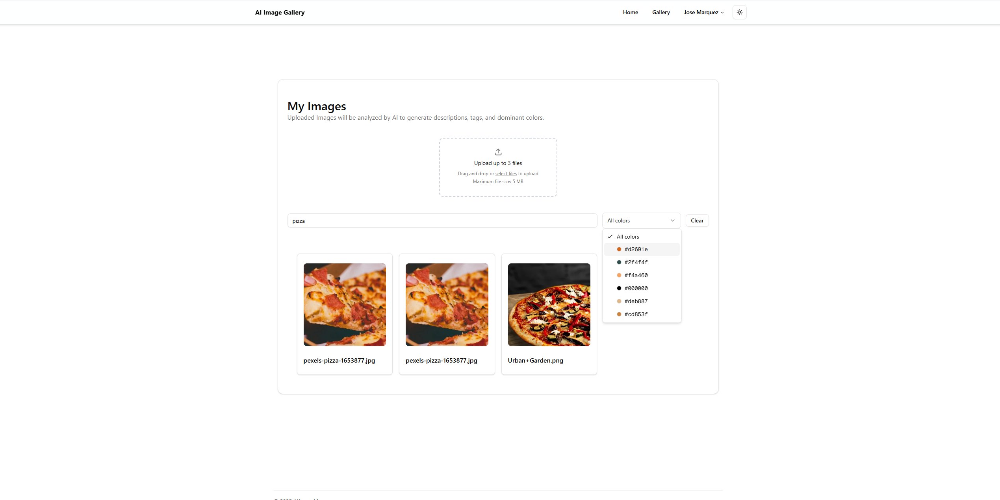
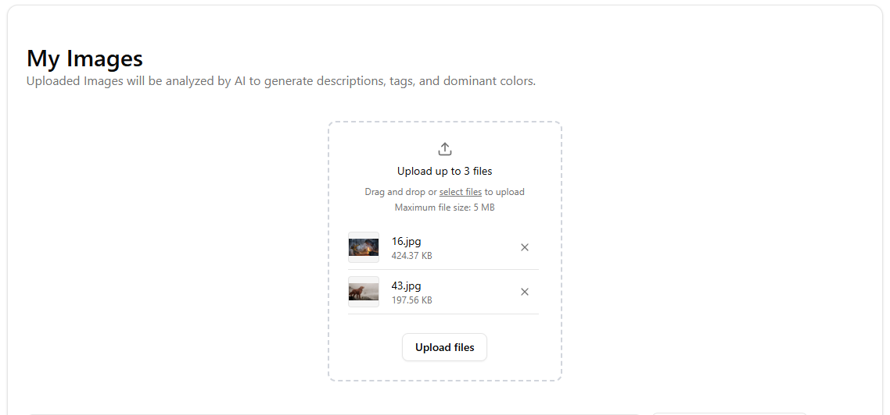

<h1 align="center">AI Image Gallery</h1>

A Next.js + Supabase app where users upload images and automatically get AI-generated tags, descriptions, and dominant colors. Built with background processing, live UI updates, and cost-conscious AI providers.

## Stack

- Next.js App Router (TypeScript, React 19)
- Supabase (Auth, Storage, Postgres + RLS)
- AWS Rekognition (labels + image properties/colors)
- OpenAI (descriptions) with optional AWS Bedrock fallback
- shadcn/ui + Tailwind CSS

## Features

- Auth: email/password signup, login, logout, protected routes (gallery)
- Upload: drag & drop, JPEG/PNG, progress, thumbnail (300×300), public storage URLs
- AI analysis (async):
  - Tags (5–10) via Rekognition DetectLabels
  - Dominant colors (top 3) via Rekognition ImageProperties
  - Description (2 concise sentences) via OpenAI
  - Background job pattern with status: pending → processing → completed/failed
- UI: badges for AI status, preview dialog with live polling, description source label

Planned (not yet implemented):

- Search by text (tags/description)
- "Find similar" (nearest neighbors)

## AI Service Architecture & Comparison

### Modular Provider System

We built a flexible architecture that supports multiple AI providers:

- **AWS Rekognition**: Tags (with OCR) + dominant colors
- **OpenAI Vision (GPT-4o-mini)**: Full vision analysis (tags, colors, descriptions)
- **AWS Bedrock (Claude/Titan)**: Text-based description generation

Environment variables control which provider handles each task:

```env
AI_TAGS_PROVIDER=rekognition          # or "openai-vision"
AI_COLORS_PROVIDER=rekognition        # or "openai-vision"
AI_DESCRIPTION_PROVIDER=openai        # or "bedrock"
```

### Default Configuration

**Rekognition** for tags/colors + **OpenAI** for descriptions

**Why this split?**

- Rekognition: Purpose-built, $0.001/image, no prompt engineering, includes OCR and parent tag enrichment
- OpenAI: Excellent natural language, $0.0003/image, factual descriptions with prompt control

**Total cost per image**: ~$0.0013 (sub-cent)

### Alternatives Considered

**AWS Bedrock (Claude/Titan)**  
✅ Pros: AWS-native, competitive cost, high quality prose  
❌ Cons: Model access gating, text-only (cannot analyze images), higher latency  
📋 Decision: Supported as optional description provider

**Google Cloud Vision API**  
✅ Pros: Comprehensive features, 1000 free images/month  
❌ Cons: $1.50 per 1000 images after free tier (50% more expensive than Rekognition)  
📋 Decision: Rejected due to higher cost with no clear advantage

**Hugging Face + FastAPI Backend**  
✅ Pros: Free tier, open source models, full customization  
❌ Cons: Cold start delays (10-30s), operational complexity, quality variance  
📋 Decision: Removed from production due to latency and maintenance burden

**OpenAI Vision for Everything**  
✅ Pros: Single API, excellent quality, simple integration  
❌ Cons: Slightly higher cost than Rekognition for basic tagging  
📋 Decision: Supported as alternative configuration for premium quality

### Cost Comparison

| Configuration                  | Cost/Image | Use Case                |
| ------------------------------ | ---------- | ----------------------- |
| Rekognition + OpenAI (default) | $0.0013    | Balanced cost & quality |
| Rekognition + Bedrock          | $0.0011    | Cheapest option         |
| OpenAI Vision only             | $0.0006    | Premium quality         |

See [docs/AI_COMPARISON.md](docs/AI_COMPARISON.md) for detailed analysis.

## How dominant colors are chosen

We call Rekognition DetectLabels with `IMAGE_PROPERTIES`, then:

- Prefer Foreground DominantColors when available; otherwise use whole-image DominantColors.
- Sort by `PixelPercent` (most prevalent first).
- Convert to hex, dedupe, take top 3.
- Optionally filter near-neutrals (configurable) if you want more “subject” color.

Note: whole-image analysis biases backgrounds (sky, walls). For stronger “subject focus,” we can crop to the largest detected object and re-run `IMAGE_PROPERTIES` (future enhancement).

## Architecture & flow

1. User uploads image → Supabase Storage stores `originals/` and generated `thumbnails/`
2. An `images` row is inserted (public URLs)
3. An `image_metadata` row is created with `ai_processing_status = processing`
4. Background analysis:
   - Rekognition → tags + colors
   - OpenAI → two-sentence description
5. Metadata updated → `completed` (or `failed`)
6. UI polls for status; preview dialog also polls when open

## Project structure (high-level)

```
src/
	app/
		(protected)/gallery/page.tsx        # Gallery page
		api/
			images/route.ts                   # List/create images (joins metadata)
			analyze-image/route.ts            # Orchestrates analysis
			test-rekognition/route.ts         # Rekognition diagnostics
			test-bedrock/route.ts             # Bedrock diagnostics (optional)
	components/
		image/                              # List, preview, drop zone, dialogs
	lib/
		ai-analysis.ts                      # Rekognition + OpenAI utilities
		images.ts                           # DB helpers (metadata CRUD)
```

## Environment

Create `.env.local` in the project root:

```ini
# Supabase (required)
NEXT_PUBLIC_SUPABASE_URL=your_supabase_url
NEXT_PUBLIC_SUPABASE_PUBLISHABLE_KEY=your_supabase_anon_key
NEXT_PUBLIC_SUPABASE_BUCKET=rekognition-bucket
# Optional (images config derives from URL if not set)
NEXT_PUBLIC_SUPABASE_HOST_NAME=your-project.supabase.co

# AWS for Rekognition (required for tags/colors)
AWS_ACCESS_KEY_ID=...
AWS_SECRET_ACCESS_KEY=...
AWS_REGION=us-east-1
AI_MAX_LABELS=10
AI_MIN_CONFIDENCE=80

# OpenAI for descriptions (recommended default)
OPENAI_API_KEY=sk-...
OPENAI_ENABLED=true
OPENAI_MODEL=gpt-3.5-turbo
OPENAI_MAX_TOKENS=120
OPENAI_TIMEOUT_MS=8000

# Optional: Bedrock (enable later if desired)
BEDROCK_ENABLED=false
BEDROCK_MODEL_ID=amazon.titan-text-express-v1

# Cost guardrail
ANALYSIS_DAILY_CAP=200

# Optional (UI labeling only)
NEXT_PUBLIC_OPENAI_ENABLED=true
NEXT_PUBLIC_BEDROCK_ENABLED=false
```

## Setup Instructions

### Prerequisites

- Node.js 18+ and npm
- Supabase account (free tier works)
- AWS account with IAM user
- OpenAI API key (optional but recommended)

### 1. Clone & Install

```bash
git clone <your-repo-url>
cd ai-image-gallery
npm install
```

### 2. Supabase Setup

1. Create a new project at [supabase.com](https://supabase.com)
2. Go to **Settings → API** and copy:
   - Project URL
   - Anon/Public key
3. Go to **Storage** → Create bucket named `rekognition-bucket` (make it public)
4. Go to **SQL Editor** → Run migrations:
   ```bash
   # Copy and execute contents from:
   supabase/migrations/002_create_image_metadata.sql
   ```

### 3. AWS Setup

1. Create IAM user with these policies:
   - `AmazonRekognitionReadOnlyAccess` (for DetectLabels)
   - Custom policy for Bedrock (optional):
   ```json
   {
     "Version": "2012-10-17",
     "Statement": [
       {
         "Effect": "Allow",
         "Action": "bedrock:InvokeModel",
         "Resource": "arn:aws:bedrock:*::foundation-model/*"
       }
     ]
   }
   ```
2. Generate access keys (save securely)

### 4. Environment Configuration

Create `.env.local`:

```env
# Supabase (required)
NEXT_PUBLIC_SUPABASE_URL=https://your-project.supabase.co
NEXT_PUBLIC_SUPABASE_PUBLISHABLE_KEY=your-anon-key
NEXT_PUBLIC_SUPABASE_BUCKET=rekognition-bucket

# AWS (required for Rekognition)
AWS_ACCESS_KEY_ID=your-aws-key
AWS_SECRET_ACCESS_KEY=your-aws-secret
AWS_REGION=us-east-1

# Rekognition Settings
AI_MAX_LABELS=10
AI_MIN_CONFIDENCE=80
AI_INCLUDE_PARENT_TAGS=true
AI_OCR_ENABLED=true

# OpenAI (recommended for descriptions)
OPENAI_API_KEY=sk-...
OPENAI_MODEL=gpt-3.5-turbo
OPENAI_VISION_MODEL=gpt-4o-mini
OPENAI_ENABLED=true

# Provider Selection (optional, defaults shown)
AI_TAGS_PROVIDER=rekognition
AI_COLORS_PROVIDER=rekognition
AI_DESCRIPTION_PROVIDER=openai

# Optional: Bedrock (if not using OpenAI)
BEDROCK_ENABLED=false
BEDROCK_MODEL_ID=anthropic.claude-3-haiku-20240307-v1:0

# Cost guardrail
ANALYSIS_DAILY_CAP=200
```

### 5. Run Development Server

```bash
npm run dev
```

Open [http://localhost:3000](http://localhost:3000)

### 6. Test the App

1. Sign up with email/password
2. Upload an image (drag & drop)
3. Watch AI analysis complete (3-5 seconds)
4. Check tags, colors, and description in preview dialog
5. Try search, "find similar", and color filters

## Deployment

### Vercel (Recommended)

1. Push code to GitHub
2. Import project in [Vercel](https://vercel.com)
3. Add environment variables from `.env.local`
4. Deploy (auto-deploys on push to main)

**Production URL**: https://ai-image-gallery-alfonso.vercel.app

### Environment Variables Required in Vercel

All variables from `.env.local` must be added in Vercel project settings:

- Supabase: `NEXT_PUBLIC_SUPABASE_*`
- AWS: `AWS_*`
- OpenAI: `OPENAI_*`
- AI config: `AI_*`

## Running locally

1. Install deps

```bash
npm install
```

2. Start dev server

```bash
npm run dev
```

Open http://localhost:3000 and sign up / log in. Upload images in the Gallery.

## API routes

- `POST /api/images` → create image row (called by client after upload)
- `GET  /api/images` → list images for current user (joins `image_metadata`)
- `GET  /api/images?id=123` → fetch a single image (used by preview polling)
- `GET  /api/images?q=search` → text search in tags/description/filename
- `GET  /api/images?similarTo=123` → find similar images (Jaccard similarity)
- `GET  /api/images?color=#ff0000` → filter by color
- `POST /api/analyze-image` → trigger analysis (called by client post-upload)
- `POST /api/test-rekognition` → diagnostics for Rekognition
- `POST /api/test-bedrock` → diagnostics for Bedrock (optional)

## Screenshots & Demo

### Gallery View


_Responsive grid layout with AI-generated tags and colors_

### Image Preview with AI Analysis


_Detailed view with AI-generated description and metadata_

### Search & Filtering


_Text search, "find similar" feature, and color-based filtering_

### Upload Experience


_Drag & drop interface with real-time upload progress_

> **Note**: Add actual screenshots to `docs/screenshots/` directory or replace with your deployed URL screenshots

**Live Demo**: https://ai-image-gallery-alfonso.vercel.app

## API routes

- `POST /api/images` → create image row (called by client after upload)
- `GET  /api/images` → list images for current user (joins `image_metadata`)
- `GET  /api/images?id=123` → fetch a single image (used by preview polling)
- `POST /api/analyze-image` → trigger analysis (called by client post-upload)
- `POST /api/test-rekognition` → diagnostics for Rekognition
- `POST /api/test-bedrock` → diagnostics for Bedrock (optional)

## Implementation notes

- Async & UI: Analysis runs in the background; the gallery and the preview dialog poll until metadata is `completed`. Loading badges and spinners indicate status.
- Description quality: Prompt is tuned for exactly two concise sentences to avoid run-ons; we also add a short continuation if the model truncates mid-thought.
- Safety & costs: A daily cap limits per-user analyses. Timeouts prevent long-running calls. Environment-driven providers let you disable Bedrock or OpenAI easily.

## Implementation notes

- Async & UI: Analysis runs in the background; the gallery and the preview dialog poll until metadata is `completed`. Loading badges and spinners indicate status.
- Description quality: Prompt is tuned for exactly two concise sentences to avoid run-ons; we also add a short continuation if the model truncates mid-thought.
- Safety & costs: A daily cap limits per-user analyses. Timeouts prevent long-running calls. Environment-driven providers let you disable Bedrock or OpenAI easily.

## Roadmap & Future Improvements

### Planned Features

**Search Enhancements**

- [ ] Pagination (20 images per page) - currently loads all
- [ ] Advanced filters (date range, file type, tag combinations)
- [ ] Full-text search with Postgres `tsvector` indexing
- [ ] Saved search queries

**AI Improvements**

- [ ] Manual tag editing/correction
- [ ] Batch reprocessing with different AI providers
- [ ] Confidence scores displayed per tag
- [ ] Custom AI prompts per user
- [ ] Google Cloud Vision provider integration
- [ ] CLIP embeddings for true semantic similarity

**Performance & Scale**

- [ ] Image compression optimization
- [ ] CDN integration for faster loading
- [ ] Redis caching for search results
- [ ] Background job queue (Bull/BullMQ) for analysis
- [ ] Lazy loading/virtualized grid for large galleries

**User Experience**

- [ ] Bulk upload (folder drag & drop)
- [ ] Image albums/collections
- [ ] Share links for individual images
- [ ] Export gallery as ZIP
- [ ] Keyboard shortcuts for navigation
- [ ] Undo/redo for edits

**Analytics & Insights**

- [ ] Storage usage dashboard
- [ ] AI cost tracking per user
- [ ] Most common tags visualization
- [ ] Upload activity timeline

**Technical Debt**

- [ ] Unit tests for AI providers (Jest)
- [ ] E2E tests for upload flow (Playwright)
- [ ] Error boundary components
- [ ] Retry logic for failed API calls
- [ ] Better error messages for users
- [ ] Accessibility audit (WCAG 2.1 AA)

### Known Limitations

- No pagination yet (loads all images at once)
- Similarity search uses simple Jaccard index (not semantic)
- AI processing not retryable from UI (must re-upload)
- No bulk operations (delete multiple, re-analyze batch)
- Auth limited to email/password (no OAuth)
- No image editing capabilities

### Performance Notes

- **Upload**: ~2-5 seconds per image (network + thumbnail generation)
- **AI Analysis**: 3-5 seconds (Rekognition 1-2s + OpenAI 2-3s)
- **Search**: <100ms for text/color, <500ms for similarity on 100 images
- **Gallery Load**: <1s for 50 images, degrades with 100+ (needs pagination)

## Roadmap (Search features)

- Text search: simple `ILIKE` on `tags` and `description`, or Postgres full‑text index.
- Similar images: embeddings (CLIP-like) in a vector column, or color histograms as a lightweight proxy.

---

Made with ❤️ for the AI Image Gallery challenge. If you run into issues, open DevTools → Network and check responses from `/api/analyze-image` and `/api/images` while the preview dialog is open—those include helpful `provider` and `debug` hints in development.
